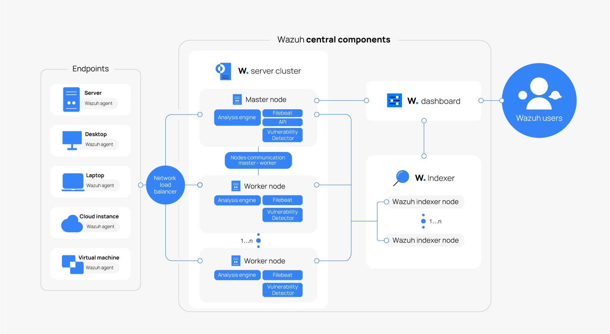

# Wazuh SIEM: Beginner-Friendly Overview

**Wazuh** is an open-source **Security Information and Event Management (SIEM)** platform designed to help organizations detect threats, monitor system activity, and respond to security incidents in real-time.

In a modern **Security Operations Center (SOC)**, Wazuh acts like a digital surveillance system—continuously collecting, analyzing, and alerting on suspicious behavior across servers, endpoints, cloud instances, and more.

---

## What is Wazuh?

Imagine hiring a smart security guard for every computer in your company. These guards not only report strange behavior but also track system changes, malware attempts, and compliance violations. That’s Wazuh.

In short:
**Wazuh = real-time security monitoring + alerting + compliance + incident response — all in one.**

---

## Wazuh in a SOC

In a SOC environment, Wazuh helps security teams:

* Monitor logs and activities across infrastructure
* Detect intrusions, vulnerabilities, malware, and misconfigurations
* Comply with regulatory standards like PCI-DSS, HIPAA, GDPR
* Respond to incidents with automated alerts and playbooks

---

## Wazuh Architecture

**Wazuh Architecture** refers to how different components are connected and work together. It’s a modular system that scales from a single server to hundreds of endpoints.





Architecture flow:

```
[Endpoints]
   ↓
[Wazuh Agents]
   ↓
[Wazuh Manager] → [Filebeat] → [Elasticsearch / OpenSearch] → [Kibana / Dashboards]
```

Simple analogy:

* Agents = CCTV cameras
* Manager = Security control room
* Filebeat = Data courier
* Elasticsearch = Data archive
* Kibana = Monitoring screens

---

## Wazuh Components

While architecture defines how parts are connected, components are the actual tools that make up the Wazuh system. Below are the core components of Wazuh:


### 1. Wazuh Agent

Monitors Endpoints

* Installed on each monitored system (Linux, Windows, macOS)
* Collects logs, monitors files, detects anomalies
* Analogy: A CCTV camera inside each device

### 2. Wazuh Manager

Central Processing Unit

* Receives data from agents
* Applies detection rules, triggers alerts, correlates events
* Analogy: The security command center reviewing all camera feeds

### 3. Filebeat

Data Shipper

* Forwards alerts generated by Wazuh Manager to Elasticsearch or OpenSearch
* Ensures log data is formatted and routed properly
* Analogy: The reliable courier that transports security reports

### 4. Elasticsearch / OpenSearch

Searchable Storage

* Stores and indexes all security event data
* Allows fast searching, filtering, and querying
* Analogy: The archive room where all reports are stored

### 5. Kibana / OpenSearch Dashboards

Visualization Interface

* Displays dashboards, logs, alerts, graphs, and trends
* Enables threat hunting, forensic analysis, and reporting
* Analogy: The TV wall where the SOC team monitors all activity

---

## Real-World Use Cases of Wazuh

Wazuh can help SOC teams with:

* Log Analysis – From OS, firewalls, web servers, and cloud
* Intrusion Detection – Detect brute-force, privilege escalation, etc.
* File Integrity Monitoring (FIM) – Detect changes to sensitive files
* Malware Detection – Spot suspicious patterns or file hashes
* Vulnerability Detection – Identify weaknesses via scans
* Compliance Auditing – Automate checks for security benchmarks
* Cloud Monitoring – Monitor AWS, Azure, and GCP environments

---

## Getting Started (The Flow)

To build a Wazuh-powered SOC, follow this setup:

1. Install Wazuh Manager on a central server
2. Deploy Wazuh Agents on all endpoints to monitor
3. Configure Filebeat to ship alerts to Elasticsearch
4. Set up Elasticsearch or OpenSearch to store and query events
5. Use Kibana or OpenSearch Dashboards for visualization and analysis

---

## Summary

Wazuh is a powerful and flexible SIEM solution that grows with your needs. It improves security visibility, simplifies compliance, and supports forensics and incident response.

Whether you're a student building a SOC lab or an organization protecting cloud workloads — Wazuh is an ideal starting point for modern cybersecurity operations.

