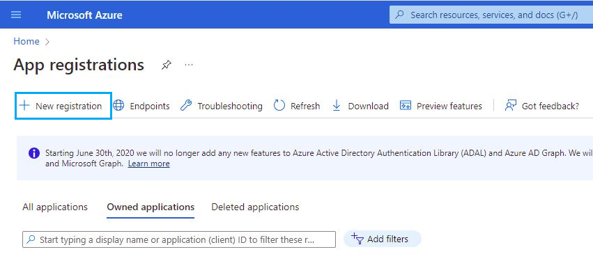
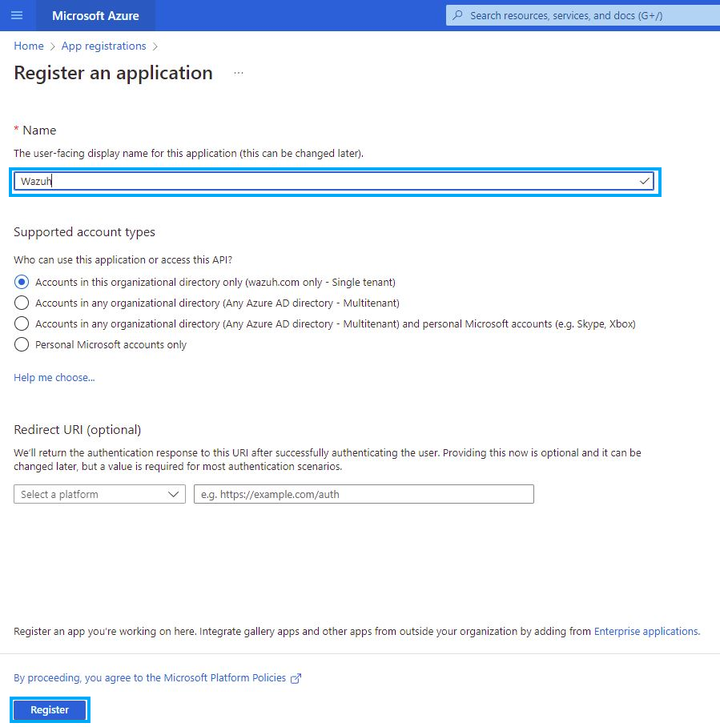
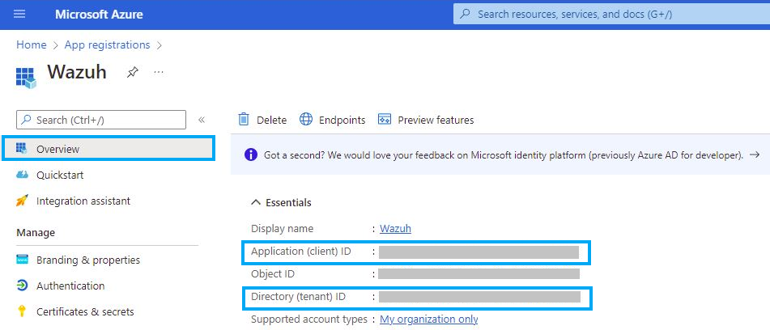
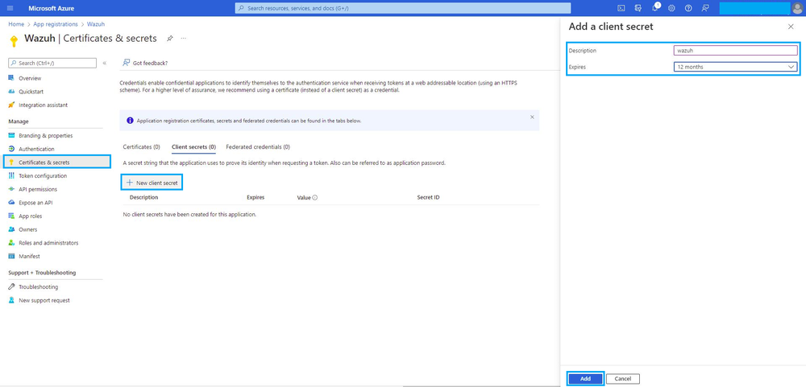
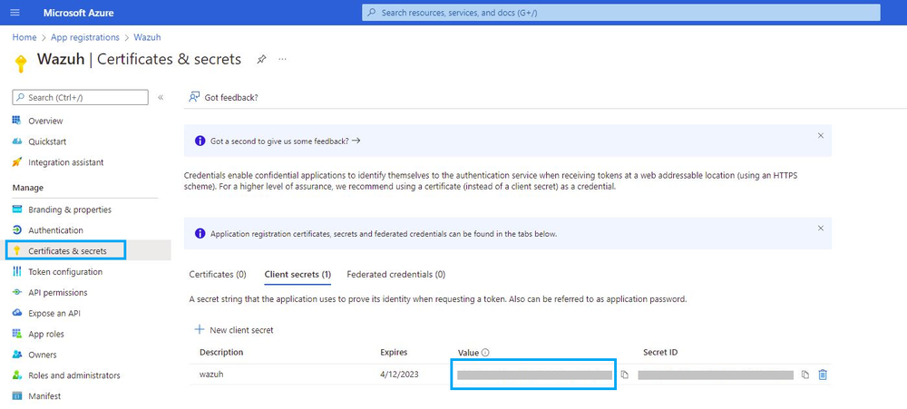
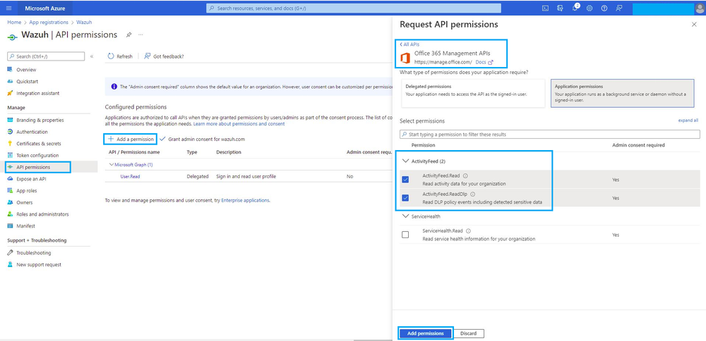
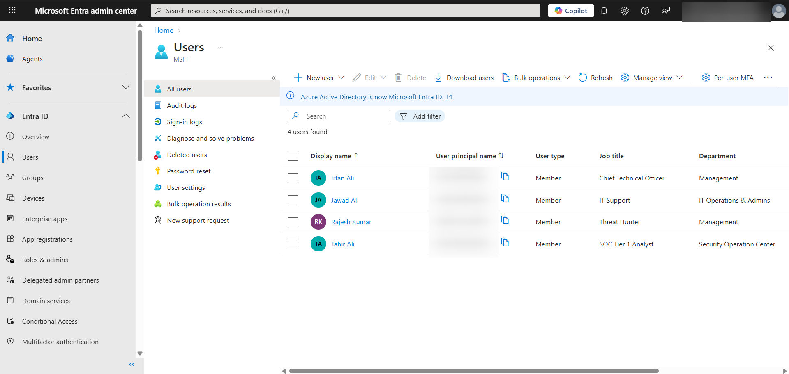
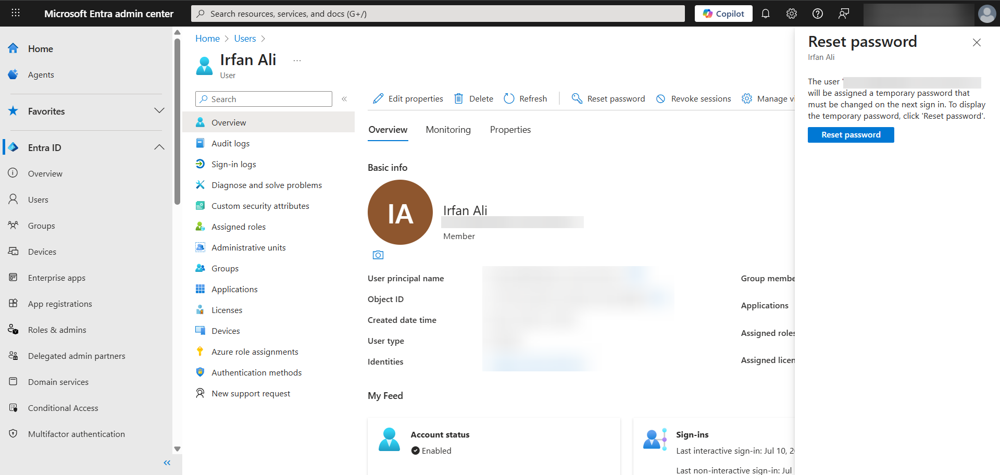
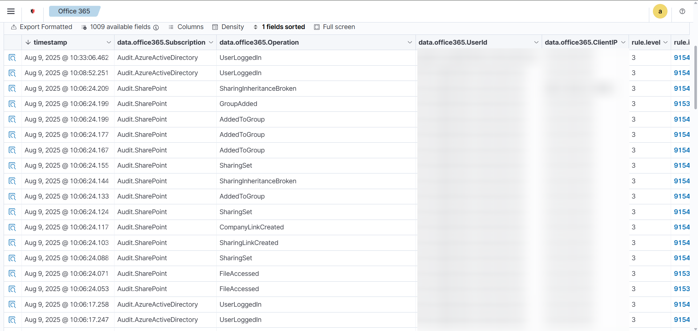
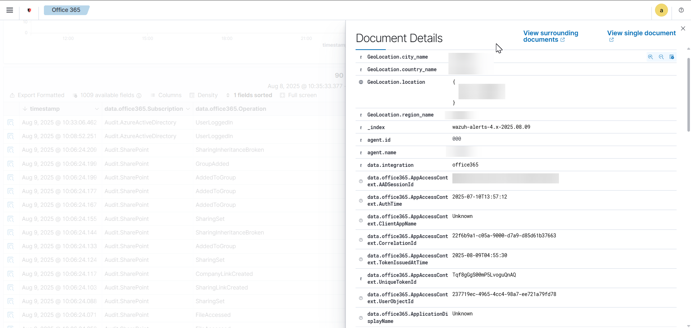

# Office 365 Integration

This document provides a comprehensive, step-by-step guide for integrating Microsoft Office 365 with the Wazuh Security Information and Event Management (SIEM) platform. By following these instructions, you will enable Wazuh to collect, analyze, and alert on audit logs from your cloud environment, enhancing your organization's overall security posture.

This guide is designed for beginners and breaks down each stage of the process, explaining key concepts in simple terms.

#### Note: Credit to Wazuh documentation, some screenshots taken from official documentation to make it easier and not having to mark out sensitive data.

### 1. Prerequisites

Before you begin, ensure you have the following:

* **Wazuh Manager:** A running Wazuh manager instance on a Linux operating system (e.g., Ubuntu).
* **Office 365/Microsoft 365 Tenant:** An active Microsoft 365 tenant with administrative access to the Azure portal and the Microsoft 365 admin center.

### 2. Integration Overview

The integration works by configuring the Wazuh manager to act as a client that regularly polls the **Office 365 Management Activity API**. This API is a service provided by Microsoft that collects all user and administrative activities across services like Exchange, SharePoint, and Azure Active Directory.

To securely connect to this API, Wazuh uses an **Azure App Registration** as a form of authentication. The process can be summarized as follows:

1.  Create a dedicated application in your Azure portal.
2.  Grant this application permission to read audit logs.
3.  Use the application's unique credentials (`Tenant ID`, `Client ID`, and `Client Secret`) in the Wazuh manager's configuration file.
4.  The Wazuh manager uses these credentials to pull logs, process them, and generate security alerts.

### 3. Part 1: Configuring Office 365 and Azure

This section covers the steps required within your Microsoft Azure and Office 365 environment.

#### Step 1.1: Enable Unified Audit Logging

Unified Audit Logging must be enabled in your tenant for the Management Activity API to collect any data. This is a one-time process.

1.  Sign in to the **Microsoft Purview compliance portal**.
2.  In the left-hand navigation pane, select **Audit**.
3.  If a banner states "Start recording user and admin activity," click **Turn on auditing**.

#### Step 1.2: Register an Application in Azure

The application serves as Wazuh's identity for secure authentication.

1.  Sign in to the **Microsoft Azure portal**.
2.  In the search bar, type `App registrations` and select it.
3.  Click **New registration**.

4.  **Name:** Provide a descriptive name like `Wazuh`.

5.  **Supported account types:** Select the default option, `Single tenant`.
6.  Click **Register**.

#### Step 1.3: Obtain Your Credentials

After registration, you will be directed to the application's overview page. This is where you find the first two required credentials.

1.  Copy the **Application (client) ID**. This is the unique identifier for your app.
2.  Copy the **Directory (tenant) ID**. This is the unique identifier for your organization.
3.  Save these values securely.


#### Step 1.4: Create a Client Secret

A client secret acts as a password for your application.

1.  On the app's left-hand menu, navigate to **Certificates & secrets**.
2.  Under "Client secrets," click **New client secret**.

3.  Add a description (e.g., `Wazuh API Secret`) and choose an expiration period.
4.  Click **Add**.
5.  Immediately after creation, a `Value` will be displayed. **This is the only time you can copy this value.** Copy it and save it securely.


#### Step 1.5: Grant API Permissions

This step grants your application permission to read Office 365 audit logs.

1.  On the app's left-hand menu, go to **API permissions**.
2.  Click **Add a permission**.
3.  Select the **Office 365 Management APIs**.
4.  Choose **Application permissions**.
5.  Check the boxes for `ActivityFeed.Read` and `ActivityFeed.ReadDlp`.

6.  Click **Add permissions**.
7.  Finally, click the **Grant admin consent for <your_tenant_name>** button. This is a critical step to activate the permissions.

### 4. Part 2: Configuring the Wazuh Manager

This section covers the steps to configure the Wazuh manager to use the credentials you just obtained.

#### Step 2.1: Access the Wazuh Configuration File

1.  Log in to your Wazuh manager.
2.  Edit the main configuration file, `ossec.conf`.

    ```bash
    sudo nano /var/ossec/etc/ossec.conf
    ```

#### Step 2.2: Add the Office 365 Integration Block

Scroll to the end of the `<ossec_config>` section and paste the following XML block. **You must replace the placeholder values with your actual credentials.**

```xml
<office365>
  <enabled>yes</enabled>
  <interval>1m</interval>
  <curl_max_size>1M</curl_max_size>
  <only_future_events>yes</only_future_events>
  
  <api_auth>
    <tenant_id>YOUR_DIRECTORY_TENANT_ID</tenant_id>
    <client_id>YOUR_APPLICATION_CLIENT_ID</client_id>
    <client_secret>YOUR_CLIENT_SECRET_VALUE</client_secret>
    <api_type>commercial</api_type>
  </api_auth>
  
  <subscriptions>
    <subscription>Audit.AzureActiveDirectory</subscription>
    <subscription>Audit.General</subscription>
    <subscription>Audit.Exchange</subscription>
    <subscription>Audit.SharePoint</subscription>
    <subscription>DLP.All</subscription>
  </subscriptions>
</office365>
````

#### Step 2.3: Understand the Configuration Parameters

  * **`<enabled>`**: `yes` activates the module.
  * **`<interval>`**: The frequency at which Wazuh polls the Office 365 API. `1m` (1 minute) is a good choice for near real-time monitoring.
  * **`<api_auth>`**: The section where your authentication credentials are stored.
      * **`<tenant_id>`**: Your organization's unique ID.
      * **`<client_id>`**: Your application's unique ID.
      * **`<client_secret>`**: The password for your application.
  * **`<subscriptions>`**: Specifies which types of logs you want to collect. The provided list covers the most common Office 365 services.

#### Step 2.4: Restart the Wazuh Manager

After saving the `ossec.conf` file, restart the Wazuh service to apply the new configuration.

```bash
sudo systemctl restart wazuh-manager
```
### 5. Verification and Troubleshooting

Once you have restarted the Wazuh Manager, it is important to confirm that the Office 365 integration is working as expected.

#### Step 5.1: Checking the Wazuh Dashboard

1. Wait a few minutes after restarting the Wazuh service.
2. Log in to your **Wazuh Dashboard**.
3. Navigate to:
```
Modules → Office 365
```
4. Here you should begin to see **alerts** and **events** from your Microsoft 365 tenant.

If you do not see any events yet, remember:
- The Office 365 Management API may take **5–10 minutes** to deliver new events.
- Only activities performed after integration will appear.

---

#### Step 5.2: Generating Test Activity in Office 365

To confirm the integration, you can manually perform some test actions in your tenant.

1. **Sign in to your Microsoft Entra Admin Center:**  
[https://entra.microsoft.com/](https://entra.microsoft.com/)  

2. **Ensure you have at least two user accounts** in your tenant.  
If you only have one, create a second for testing.

3. **Log in to one of the test accounts in an Incognito/Private browser window.**  
In this example, we will log in as a non-admin user (e.g., "Ifran Ali").

4. **As the Tenant Admin:**
- Reset the password for that test user.
- Copy the temporary password provided.

  
  

5. **Log in to the test account via** [https://office.com](https://office.com)  
- Use the email address and temporary password.
- If prompted, set up MFA (Multi-Factor Authentication).
- Complete the password reset process.

6. **Perform some activities** while logged in as the test user:
- Open Outlook and send an email to another user in your tenant.
- Upload a file to OneDrive.
- View and share that file with other users.
- Delete the file.

7. Wait a few minutes, then return to your **Wazuh Dashboard**.

---

#### Step 5.3: Viewing the Logs in Wazuh

When you go back to the **Office 365** module in Wazuh, you should now see audit logs for the activities you performed.




Below is an example of what the logs might look like (with sensitive details removed):

| Timestamp              | Subscription               | Operation                  | UserId               | ClientIP      | Rule Level | Rule ID |
|------------------------|----------------------------|----------------------------|----------------------|--------------|------------|---------|
| Aug 9, 2025 @ 10:33:06 | Audit.AzureActiveDirectory | UserLoggedIn               | testuser@domain.com  | [REDACTED]   | 3          | 91545   |
| Aug 9, 2025 @ 10:06:24 | Audit.SharePoint           | FileAccessed               | testuser@domain.com  | [REDACTED]   | 3          | 91537   |
| Aug 9, 2025 @ 10:06:24 | Audit.SharePoint           | SharingLinkCreated         | testuser@domain.com  | [REDACTED]   | 3          | 91544   |
| Aug 9, 2025 @ 10:06:17 | Audit.AzureActiveDirectory | UserLoggedIn               | testuser@domain.com  | [REDACTED]   | 3          | 91545   |

---

#### Step 5.4: Understanding the Key Fields

- **timestamp** — The exact time when the activity occurred.
- **data.office365.Subscription** — The service or module the event came from, e.g.:
- `Audit.AzureActiveDirectory` → login and identity events.
- `Audit.SharePoint` → file, folder, and sharing activities.
- **data.office365.Operation** — The specific action performed:
- `UserLoggedIn` → A user signed into Microsoft 365.
- `FileAccessed` → A file was opened/viewed.
- `SharingLinkCreated` → A share link was created for a file/folder.
- **data.office365.UserId** — The account that performed the action.
- **data.office365.ClientIP** — The IP address from where the action was performed (redacted here).
- **rule.level** — Indicates severity or importance (e.g., 3 = informational).
- **rule.id** — The unique identifier for the detection rule in Wazuh.

---

#### Step 5.5: Common Errors and Fixes

- **"Invalid client secret provided"**  
This usually happens if you entered the **Client Secret ID** instead of the **Client Secret Value**.  
Solution: Generate a new secret and copy its value immediately.

- **"Tenant does not exist"**  
This often means the `tenant_id` and `client_id` were swapped in the configuration file.  
Solution: Double-check that each is in the correct field.

- **Events not appearing immediately**  
The Office 365 API has a small delay (5–10 minutes) before new activities are available.  
Solution: Wait and refresh the dashboard.

---

### 6. Understanding the Office 365 Logs

The events collected through this integration are **audit logs**.  
These logs:
- Show **who** did **what**, and **when**.
- Do **not** include sensitive content like email text or file data.

Examples of common categories:
- **Exchange Online:**  
`Send`, `Delete`, `MailItemsAccessed`.
- **SharePoint / OneDrive:**  
`FileUploaded`, `FileDeleted`, `SharingSet`, `FileAccessed`.
- **Azure Active Directory:**  
`UserLoggedIn`, `UserPasswordChanged`, admin changes.

These logs allow you to detect suspicious activity and investigate incidents without exposing private content.

**📖 Read Next:** [05 – pfSense with Wazuh](../05-network-monitoring/pfsense-with-wazuh.md) — Firewall log collection with pfSense.