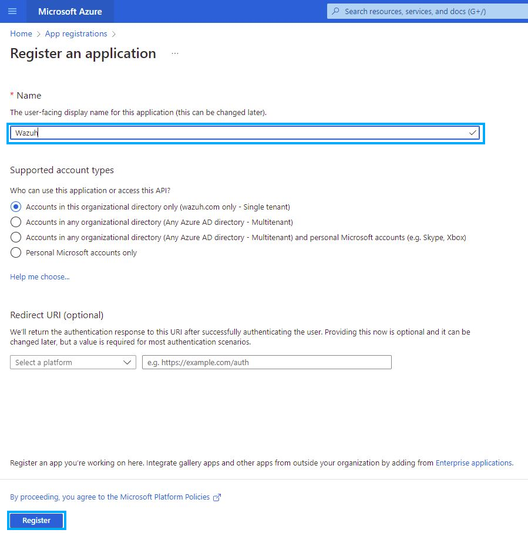
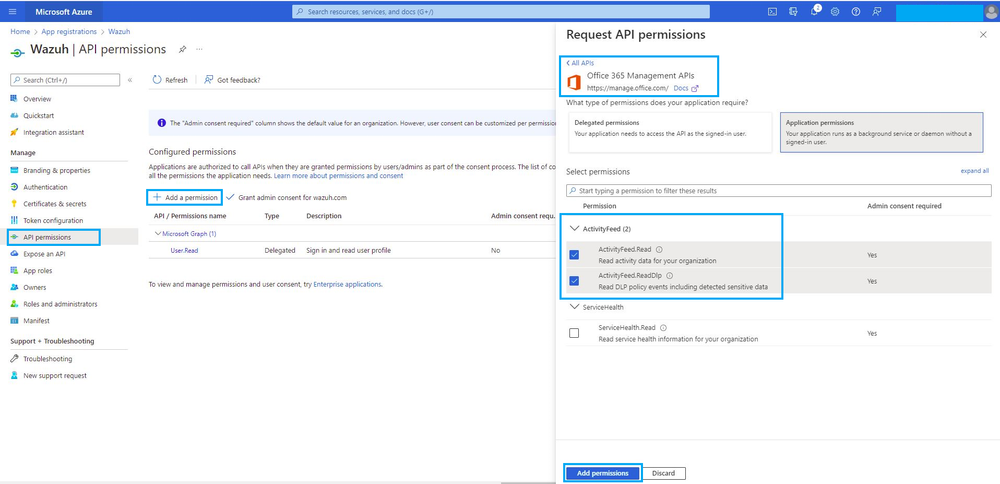
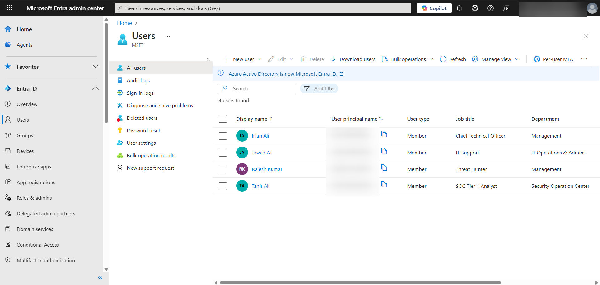
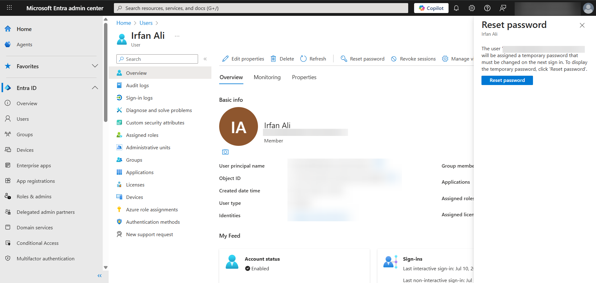

# Office 365 Integration

This document provides a comprehensive, step-by-step guide for integrating Microsoft Office 365 with the Wazuh Security Information and Event Management (SIEM) platform. By following these instructions, you will enable Wazuh to collect, analyze, and alert on audit logs from your cloud environment, enhancing your organization's overall security posture.

This guide is designed for beginners and breaks down each stage of the process, explaining key concepts in simple terms.

## Note: Credit to Wazuh documentation, some screenshots taken from official documentation to make it easier and not having to mark out sensitive data.

### 1. Prerequisites

Before you begin, ensure you have the following:

* **Wazuh Manager:** A running Wazuh manager instance on a Linux operating system (e.g., Ubuntu).
* **Office 365/Microsoft 365 Tenant:** An active Microsoft 365 tenant with administrative access to the Azure portal and the Microsoft 365 admin center.

### 2. Integration Overview

The integration works by configuring the Wazuh manager to act as a client that regularly polls the **Office 365 Management Activity API**. This API is a service provided by Microsoft that collects all user and administrative activities across services like Exchange, SharePoint, and Azure Active Directory.

To securely connect to this API, Wazuh uses an **Azure App Registration** as a form of authentication. The process can be summarized as follows:

1.  Create a dedicated application in your Azure portal.
2.  Grant this application permission to read audit logs.
3.  Use the application's unique credentials (`Tenant ID`, `Client ID`, and `Client Secret`) in the Wazuh manager's configuration file.
4.  The Wazuh manager uses these credentials to pull logs, process them, and generate security alerts.

### 3. Part 1: Configuring Office 365 and Azure

This section covers the steps required within your Microsoft Azure and Office 365 environment.

#### Step 1.1: Enable Unified Audit Logging

Unified Audit Logging must be enabled in your tenant for the Management Activity API to collect any data. This is a one-time process.

1.  Sign in to the **Microsoft Purview compliance portal**.
2.  In the left-hand navigation pane, select **Audit**.
3.  If a banner states "Start recording user and admin activity," click **Turn on auditing**.

#### Step 1.2: Register an Application in Azure

The application serves as Wazuh's identity for secure authentication.

1.  Sign in to the **Microsoft Azure portal**.
2.  In the search bar, type `App registrations` and select it.
3.  Click **New registration**.

4.  **Name:** Provide a descriptive name like `Wazuh-Office365-Integration`.

5.  **Supported account types:** Select the default option, `Single tenant`.
6.  Click **Register**.

#### Step 1.3: Obtain Your Credentials

After registration, you will be directed to the application's overview page. This is where you find the first two required credentials.

1.  Copy the **Application (client) ID**. This is the unique identifier for your app.
2.  Copy the **Directory (tenant) ID**. This is the unique identifier for your organization.
3.  Save these values securely.


#### Step 1.4: Create a Client Secret

A client secret acts as a password for your application.

1.  On the app's left-hand menu, navigate to **Certificates & secrets**.
2.  Under "Client secrets," click **New client secret**.

3.  Add a description (e.g., `Wazuh API Secret`) and choose an expiration period.
4.  Click **Add**.
5.  Immediately after creation, a `Value` will be displayed. **This is the only time you can copy this value.** Copy it and save it securely.


#### Step 1.5: Grant API Permissions

This step grants your application permission to read Office 365 audit logs.

1.  On the app's left-hand menu, go to **API permissions**.
2.  Click **Add a permission**.
3.  Select the **Office 365 Management APIs**.
4.  Choose **Application permissions**.
5.  Check the boxes for `ActivityFeed.Read` and `ActivityFeed.ReadDlp`.

6.  Click **Add permissions**.
7.  Finally, click the **Grant admin consent for <your_tenant_name>** button. This is a critical step to activate the permissions.

### 4. Part 2: Configuring the Wazuh Manager

This section covers the steps to configure the Wazuh manager to use the credentials you just obtained.

#### Step 2.1: Access the Wazuh Configuration File

1.  Log in to your Wazuh manager.
2.  Edit the main configuration file, `ossec.conf`.

    ```bash
    sudo nano /var/ossec/etc/ossec.conf
    ```

#### Step 2.2: Add the Office 365 Integration Block

Scroll to the end of the `<ossec_config>` section and paste the following XML block. **You must replace the placeholder values with your actual credentials.**

```xml
<office365>
  <enabled>yes</enabled>
  <interval>1m</interval>
  <curl_max_size>1M</curl_max_size>
  <only_future_events>yes</only_future_events>
  
  <api_auth>
    <tenant_id>YOUR_DIRECTORY_TENANT_ID</tenant_id>
    <client_id>YOUR_APPLICATION_CLIENT_ID</client_id>
    <client_secret>YOUR_CLIENT_SECRET_VALUE</client_secret>
    <api_type>commercial</api_type>
  </api_auth>
  
  <subscriptions>
    <subscription>Audit.AzureActiveDirectory</subscription>
    <subscription>Audit.General</subscription>
    <subscription>Audit.Exchange</subscription>
    <subscription>Audit.SharePoint</subscription>
    <subscription>DLP.All</subscription>
  </subscriptions>
</office365>
````

#### Step 2.3: Understand the Configuration Parameters

  * **`<enabled>`**: `yes` activates the module.
  * **`<interval>`**: The frequency at which Wazuh polls the Office 365 API. `1m` (1 minute) is a good choice for near real-time monitoring.
  * **`<api_auth>`**: The section where your authentication credentials are stored.
      * **`<tenant_id>`**: Your organization's unique ID.
      * **`<client_id>`**: Your application's unique ID.
      * **`<client_secret>`**: The password for your application.
  * **`<subscriptions>`**: Specifies which types of logs you want to collect. The provided list covers the most common Office 365 services.

#### Step 2.4: Restart the Wazuh Manager

After saving the `ossec.conf` file, restart the Wazuh service to apply the new configuration.

```bash
sudo systemctl restart wazuh-manager
```


### 5\. Verification and Troubleshooting

  * **Verification:** After restarting, wait a few minutes and log in to your **Wazuh dashboard**. Navigate to the **Modules** section and select **Office 365**. You should begin to see alerts and events populated from your tenant.

  At this point, you should start to see events being digested in the events dashboard.

Now, log in to tenant https://entra.microsoft.com/ , you must have differnt atleast two user account if not create them, and then open an incogition and log in to that accounts, let's say, I've four accounts in my tenant, that are tahir, ifran, rkum4r and jawad.


Now in my case, What I'm doing is I'm logging into the Ifran Ali account's. Becuase I'm the admin of the tenant and I know reset the Ifran Password. So let's do that, reset the ifran password, Copy that password, and open another incognito window or another brower and login into that account. 


Go to https://office.com login with the email address and input the temporary password you set there, may you have to set the MFA, do it and it will redirect you the main office page i.e copilot.

Now here's what the magic happens, now we are in ifran's account, do whatever you want, open an outlook, draft and email, send it to another user i.e Tahir/rkumr4/jawad etc in my case, upload any file to the one drive, view it, share it with other users, and then delete it.

After all of things, wait for a few minutes, grab a coffee, you've done your job, and then come back to wazuh dashboard, head to the office365 module and here you'll see the all logs/events of activities you have done.
Let's have a look.


  * **Common Errors:**
      * **"Invalid client secret provided"**: This means you've used the Client Secret ID instead of the Client Secret Value. You must generate a new secret and copy its value.
      * **"Tenant does not exist"**: This usually indicates that the `tenant_id` and `client_id` have been swapped in the configuration. Double-check that they are in the correct fields.
  * **API Latency:** Be aware that it can take several minutes for a new event in Office 365 to become available to the API. If you perform an action, it may not appear in Wazuh for 5-10 minutes or more.

### 6\. Understanding the Office 365 Logs

The logs collected by this integration are **audit logs**. This means they provide a record of who did what, and when, for security and compliance purposes. They **do not** contain sensitive content like the body of an email or the content of a file.

Instead, the logs will show granular details such as:

  * **Exchange:** `Send`, `Delete`, and `MailItemsAccessed` operations, along with the user and timestamp.
  * **SharePoint/OneDrive:** `FileUploaded`, `FileDeleted`, `SharingSet`, and `FileAccessed` events.
  * **Azure Active Directory:** `UserLoggedIn`, `UserPasswordChanged`, and administrative changes.

This information is sufficient for detecting suspicious activity and responding to security incidents within your cloud environment.
