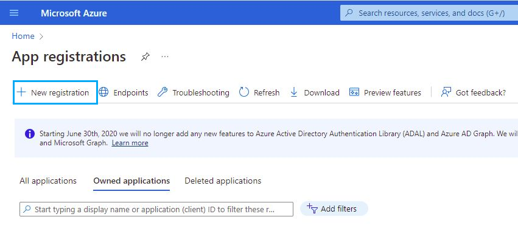
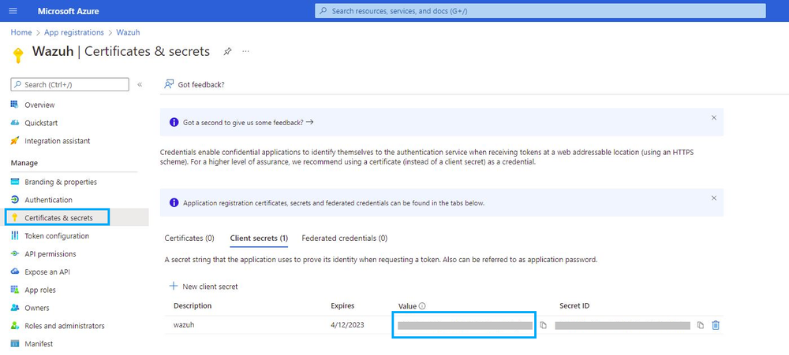

# Office 365 Integration with Wazuh SIEM

This document provides a comprehensive, step-by-step guide for integrating **Microsoft Office 365** with the **Wazuh Security Information and Event Management (SIEM)** platform.
Following these instructions will enable Wazuh to collect, analyze, and alert on audit logs from your Microsoft 365 environment, strengthening your organization's security posture.

> **Note:** Some screenshots are taken from the official Wazuh documentation to simplify the process while avoiding the display of sensitive data.
> Reference: [Wazuh Documentation - Office 365 Integration](https://documentation.wazuh.com/current/cloud-security/office365/index.html)

---

## 1. Prerequisites

Before starting, ensure you have:

* **Wazuh Manager**: Running on a Linux OS (e.g., Ubuntu).
* **Microsoft 365 Tenant**: Active tenant with administrative access to both:

  * [Microsoft Azure Portal](https://portal.azure.com/)
  * [Microsoft 365 Admin Center](https://admin.microsoft.com/)

---

## 2. Integration Overview

The integration works by configuring Wazuh to connect to the **Office 365 Management Activity API**, which collects user and admin activities from services such as Exchange, SharePoint, and Azure AD.

**Workflow Summary:**

1. Register an application in Azure.
2. Grant it API permissions to read audit logs.
3. Obtain the **Tenant ID**, **Client ID**, and **Client Secret**.
4. Configure these in the Wazuh Manager.
5. Wazuh pulls logs via the API and generates security alerts.

---

## 3. Part 1: Configuring Office 365 and Azure

### 3.1 Enable Unified Audit Logging

1. Sign in to the [Microsoft Purview compliance portal](https://compliance.microsoft.com/).
2. In the left menu, select **Audit**.
3. If prompted with *"Start recording user and admin activity"*, click **Turn on auditing**.

---

### 3.2 Register an Application in Azure

1. Sign in to the [Azure portal](https://portal.azure.com/).

2. Search for **App registrations** and open it.

3. Click **New registration**.

   

4. **Name**: Enter a descriptive name, e.g., `Wazuh-Office365-Integration`.

   

5. **Supported account types**: Select **Single tenant**.

6. Click **Register**.

---

### 3.3 Obtain Application Credentials

After registration:

1. Copy the **Application (client) ID**.
2. Copy the **Directory (tenant) ID**.
3. Store both securely.

   

---

### 3.4 Create a Client Secret

1. In the app menu, go to **Certificates & secrets**.

2. Under **Client secrets**, click **New client secret**.

   

3. Add a description (e.g., `Wazuh API Secret`) and set an expiration.

4. Click **Add**.

5. Copy the **Value** immediately (only visible once).

   

---

### 3.5 Grant API Permissions

1. In the app menu, select **API permissions**.

2. Click **Add a permission**.

3. Select **Office 365 Management APIs**.

4. Choose **Application permissions**.

5. Enable:

   * `ActivityFeed.Read`
   * `ActivityFeed.ReadDlp`

   

6. Click **Add permissions**.

7. Click **Grant admin consent for \<tenant\_name>**.

---

## 4. Part 2: Configuring Wazuh Manager

### 4.1 Edit the Configuration File

1. SSH into your Wazuh manager.
2. Edit `ossec.conf`:

   ```bash
   sudo nano /var/ossec/etc/ossec.conf
   ```

---

### 4.2 Add the Office 365 Integration Block

Paste the following inside `<ossec_config>` and replace placeholders with your values:

```xml
<office365>
  <enabled>yes</enabled>
  <interval>1m</interval>
  <curl_max_size>1M</curl_max_size>
  <only_future_events>yes</only_future_events>
  
  <api_auth>
    <tenant_id>YOUR_DIRECTORY_TENANT_ID</tenant_id>
    <client_id>YOUR_APPLICATION_CLIENT_ID</client_id>
    <client_secret>YOUR_CLIENT_SECRET_VALUE</client_secret>
    <api_type>commercial</api_type>
  </api_auth>
  
  <subscriptions>
    <subscription>Audit.AzureActiveDirectory</subscription>
    <subscription>Audit.General</subscription>
    <subscription>Audit.Exchange</subscription>
    <subscription>Audit.SharePoint</subscription>
    <subscription>DLP.All</subscription>
  </subscriptions>
</office365>
```

---

### 4.3 Parameter Explanation

* `<enabled>`: Enable/disable module.
* `<interval>`: API polling frequency (1 minute recommended).
* `<api_auth>`: Authentication details.
* `<subscriptions>`: Specifies log types to collect.

---

### 4.4 Restart Wazuh Manager

```bash
sudo systemctl restart wazuh-manager
```

---

## 5. Verification & Testing

1. Wait a few minutes.

2. Log into the Wazuh dashboard → **Modules** → **Office 365**.

3. Perform activity tests:

   * Log into multiple tenant accounts.
   * Send emails, upload files, share, and delete files.
   * Example test logins: `tahir`, `irfran`, `rkum4r`, `jawad`.

   

4. Example: Reset a test account’s password, log in via [office.com](https://office.com), and perform actions in Outlook and OneDrive.

   

5. Return to Wazuh after \~5-10 mins and check for logged events.

   

---

## 6. Understanding Sample Logs

Below is an interpretation of example log fields without revealing sensitive data:

| Field                           | Description                                                              |
| ------------------------------- | ------------------------------------------------------------------------ |
| **timestamp**                   | Exact date and time of the event.                                        |
| **data.office365.Subscription** | Source service (e.g., `Audit.AzureActiveDirectory`, `Audit.SharePoint`). |
| **data.office365.Operation**    | Specific action performed (e.g., `UserLoggedIn`, `FileAccessed`).        |
| **data.office365.UserId**       | Account performing the action.                                           |
| **data.office365.ClientIP**     | IP address from which the action originated.                             |
| **rule.level**                  | Alert severity (numeric scale).                                          |
| **rule.id**                     | Wazuh rule triggered for the event.                                      |

**Examples:**

* `UserLoggedIn` from Azure AD: Sign-in event recorded for a user.
* `FileAccessed` in SharePoint: File viewed or opened by the user.
* `SharingSet`: Sharing permissions changed.
* `AddedToGroup`: User added to a group.

---

## 7. Common Issues & Solutions

* **Invalid client secret provided**: Ensure you copied the *Value*, not the *ID*.
* **Tenant does not exist**: Check that `tenant_id` and `client_id` are in the correct fields.
* **API latency**: Events can take 5–10 minutes to appear.

---

## 8. Security Notes

* These logs are **audit logs** — they track *who did what and when*.
* They do not contain sensitive content (email bodies or file contents).
* Useful for:

  * Detecting suspicious logins
  * Tracking file access and sharing
  * Monitoring administrative actions

