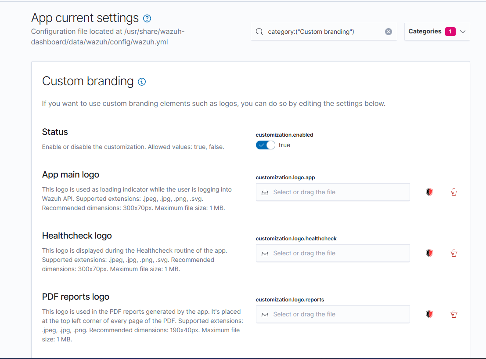

# Custom Branding: Upload App, HealthCheck, and Report Logos

This guide explains how to upload logos for in-app areas like dashboards, reports, and health checks.

---

## 1. Access Dashboard App Settings

1. Log into the Wazuh Dashboard.
2. Open the sidebar menu and navigate to:
````
Dashboard Management → App Settings
````

---

## 2. Upload Logos

In the relevant fields (e.g., App logo, HealthCheck logo, Report logo), upload your custom images.

### Recommended Formats:
- `.png`, `.svg`, `.jpg`

### Recommended Size:
- Logos should have transparent backgrounds and optimal dimensions (e.g., 300x100 pixels).

---

## 3. Save Changes

Scroll down and click the `Save` button to apply settings.

---




## 4. Refresh or Restart

Sometimes a hard refresh (`Ctrl + Shift + R`) is required. If issues persist:
```bash
sudo systemctl restart wazuh-dashboard
````

