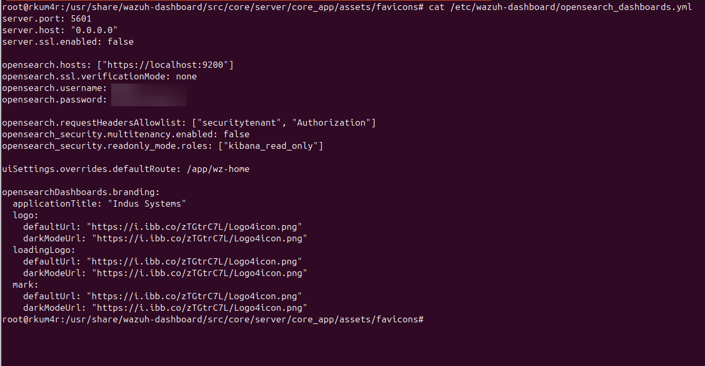

# Modifying the Dashboard Title and Header Branding

You can modify the page title, login logo, dashboard logos, and loading screen through the main configuration file.

---

## 1. Open the Configuration File

Edit the Wazuh Dashboard configuration:

```bash
sudo nano /etc/wazuh-dashboard/opensearch_dashboards.yml
```

Alternate path for some installations:

```bash
sudo nano /usr/share/wazuh-dashboard/config/opensearch_dashboards.yml
```

---

## 2. Add or Modify Branding Fields

Below is an example of a customized configuration block:

```yaml
opensearchDashboards.branding.applicationTitle: "Organization Name"

opensearch_security.ui.basicauth.login.brandimage: "https://ibb.co/your-uploaded-image-url"

opensearchDashboards.branding:
  logo:
    defaultUrl: "https://ibb.co/logo-light.svg"
    darkModeUrl: "https://ibb.co/logo-dark.svg"
  loadingLogo:
    defaultUrl: "https://ibb.co/loading-light.svg"
    darkModeUrl: "https://ibb.co/loading-dark.svg"
  mark:
    defaultUrl: "https://ibb.co/mark-light.svg"
    darkModeUrl: "https://ibb.co/mark-dark.svg"
```

You can host images via platforms like:
- [https://ibb.co/](https://ibb.co/)

Ensure that image links are direct and accessible via HTTPS.

---


## 3. Restart Wazuh Dashboard

```bash
sudo systemctl restart wazuh-dashboard
```

The changes should be visible immediately after restart.
