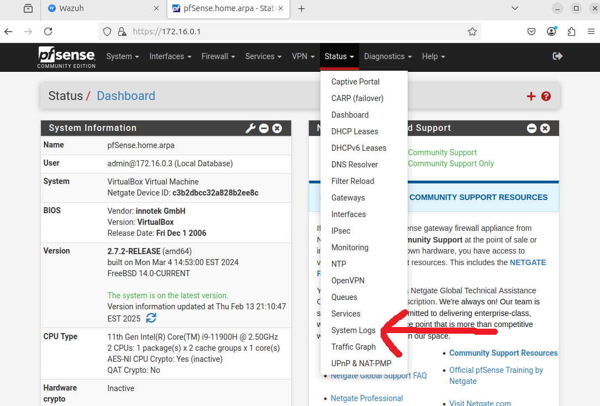
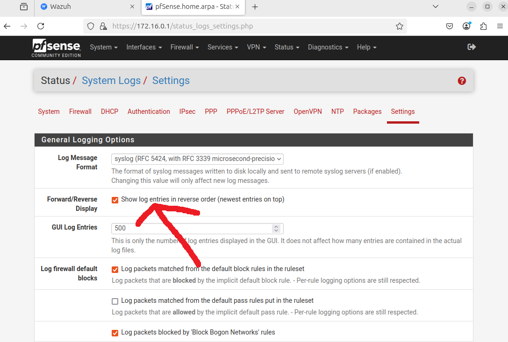

# Integrating pfSense Firewall Logs with Wazuh SIEM

This guide provides a comprehensive walkthrough for integrating **pfSense firewall logs** into the **Wazuh SIEM platform**. This integration enables centralized logging, enhances network visibility, and improves threat detection capabilities. Before diving into the configuration steps, it’s important to understand the foundational components involved in this setup.


## What is a Firewall?

A **firewall** is a network security device that can be software-based, hardware-based, or a combination of both. It monitors and filters incoming and outgoing network traffic based on a defined set of security rules. Its primary role is to permit or block data packets between trusted internal networks and untrusted external networks (such as the internet).

Think of a firewall as a **gatekeeper** that ensures only authorized traffic can pass into or out of your network.

> **Want a deeper understanding of firewalls and next-generation firewalls (NGFW)?**  
> Read this article: [Deep Dive into Firewalls – by Rajesh Menghwar](https://medium.com/@rajeshmenghwar)


## What is pfSense?

**pfSense** is a free and open-source firewall and router software distribution based on **FreeBSD**. It offers a comprehensive suite of features designed for securing networks of all sizes, from home labs to enterprise environments.

### Key Features of pfSense:
- Stateful Packet Inspection (SPI)
- VPN Support (IPSec, OpenVPN, WireGuard)
- DNS and DHCP Services
- Network Address Translation (NAT)
- Logging and Real-time Monitoring
- Traffic Shaping and Load Balancing
- Intrusion Detection/Prevention (via Suricata or Snort)

> pfSense is maintained by **Electric Sheep Fencing LLC** and is widely recognized as one of the most robust and flexible open-source firewall platforms available today.

> **Explore more on pfSense setups and labs:**  
> [GitHub: Working with Firewalls - pfSense](https://github.com/raajeshmenghwar/working-with-firewalls/tree/main/pfsense)


## Why Integrate pfSense with Wazuh?

**Wazuh** is an open-source Security Information and Event Management (SIEM) solution that provides log analysis, intrusion detection, vulnerability detection, and more.

Integrating pfSense with Wazuh allows you to:
- Centralize pfSense log data for analysis
- Detect network anomalies in real-time
- Correlate firewall events with endpoint security logs
- Improve visibility across the security operations center (SOC)


## Prerequisites

Before proceeding, ensure the following environment is in place:

- A virtualized environment (VMware Workstation, ESXi, or similar)
- A fully configured **Wazuh stack** including:
  - Wazuh Manager
  - Wazuh Indexer
  - Wazuh Dashboard
- A **pfSense VM** installed and accessible


## Step-by-Step Integration Guide

### Step 1: Boot the Virtual Machines

1. Power on your **pfSense** VM.
2. Start your **Linux VM** (e.g., Ubuntu).
3. Boot up your **Wazuh VM** and log in using the default credentials (e.g., `admin/admin`).


### Step 2: Access the Wazuh Dashboard

- On the Linux VM, open a browser and enter the IP address of your Wazuh Dashboard.
- If the IP is unknown, run `ip a` in the terminal of the Wazuh VM to locate it.


### Step 3: Access the pfSense Web Interface

- Find the **LAN IP address** displayed in the pfSense VM console.  
  

- Open the IP in your browser. If prompted with a certificate warning, click **Advanced > Accept the Risk and Continue**.  
  

- Login credentials:
  - **Username:** `admin`
  - **Password:** `pfsense`


### Step 4: Change the Default Admin Password

- After logging in, follow the prompt to **change the default password**.
- Set a secure password and click **Save**.


### Step 5: Set Timezone in pfSense

1. Navigate to **System > General Setup**.
2. Scroll to the **Timezone** section and select your local time zone.
3. Click **Save**.

> Setting the correct timezone ensures accurate timestamping of log entries, which is critical for log correlation.


### Step 6: Enable Syslog Forwarding on pfSense

1. Go to **Status > System Logs**.  
   

2. Click on the **Settings** tab.  
   

3. Set `Log Message Format` to `syslog`.

4. (Optional) Enable `Reverse Display` to view the latest logs at the top.  
   

5. Enable `Send log messages to remote syslog server`.

6. Set `Source Address` to `LAN`.  
   


### Step 7: Configure the Remote Syslog Server

In the **Remote Log Servers** field, input your Wazuh Manager IP and the syslog port:

```
192.168.1.10:514
````

> The port `514/UDP` is the default for syslog messages.

Under **Remote Syslog Contents**, select only:

- System Events
- Firewall Events
- DNS Events
- DHCP Events

> **Important:** Avoid selecting "Everything" to prevent excessive and unnecessary log ingestion.  
> 

Click **Save** to apply the configuration.


### Step 8: Add a Firewall Rule to Allow Syslog Traffic

1. Go to **Firewall > Rules > LAN**.  
   

2. Click the green **Add** button to insert a new rule at the top.  
   

3. Configure the rule:
   - **Protocol**: `UDP`
   - **Source**: `LAN Subnet`
   - **Destination**: `Single host or alias` → enter Wazuh Manager IP
   - **Destination Port**: `514`
   - **Description**: `Forward syslog entries to Wazuh`

4. Click **Save**, then click **Apply Changes**.  
   


### Step 9: Configure Wazuh to Listen for Syslog

1. Access the **Wazuh Dashboard** in your browser.
2. Go to **Server Management > Settings**.
3. Click **Edit Configuration**.
4. Add the following XML configuration block:

```xml
<remote>
  <connection>syslog</connection>
  <port>514</port>
  <protocol>udp</protocol>
  <allowed-ips>192.168.1.0/24</allowed-ips>
  <local_ip>192.168.1.10</local_ip>
</remote>
````

 Replace the values:

 * `allowed-ips`: Subnet from which pfSense will send logs (e.g., `192.168.1.0/24`)
 * `local_ip`: Wazuh Manager's IP address

5. Click **Save**, then **Restart Manager** and confirm.


### Step 10: Validate the Integration

To test the integration:

1. Log out of the pfSense web GUI.
2. Attempt a failed login with incorrect credentials to generate an event.
3. Go back to **Wazuh Dashboard**:

   * Navigate to **Explore > Discover**
   * Search for the failed login log under `syslog` source

   

If the log appears, the integration is working correctly.


## Summary

By integrating **pfSense** with **Wazuh**, you have created a streamlined and centralized solution for collecting, parsing, and monitoring firewall events. This setup supports:

* Real-time detection of suspicious activity
* Centralized log aggregation
* Better incident response
* Improved SOC visibility

> This integration is foundational for building out a complete SOC/SIEM environment. In the next guide, we will explore how to create alerts and dashboards in Wazuh based on pfSense logs.


## References and Further Reading

* [Wazuh Official Documentation](https://documentation.wazuh.com)
* [pfSense Official Docs](https://docs.netgate.com/pfsense/en/latest/)
* [Deep Dive into Firewalls (Rajesh Menghwar - Medium)](https://medium.com/@rajeshmenghwar)
* [GitHub: Working with Firewalls - pfSense](https://github.com/raajeshmenghwar/working-with-firewalls/tree/main/pfsense)


**📖 Read Next:** [05 – Suricata IDS Integration](../05-network-monitoring/suricata-ids-integration.md) — Integrating Suricata IDS for network threat detection.
