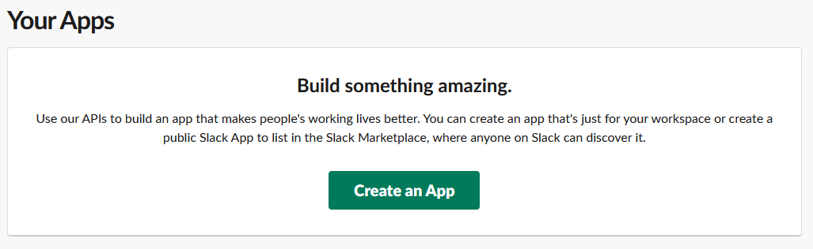
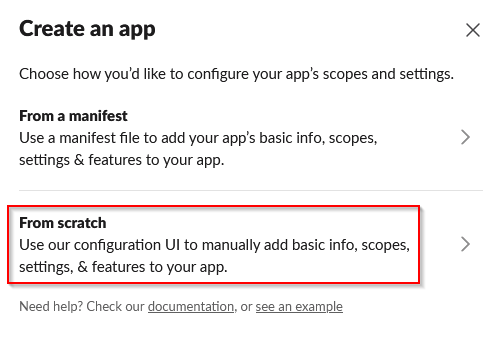
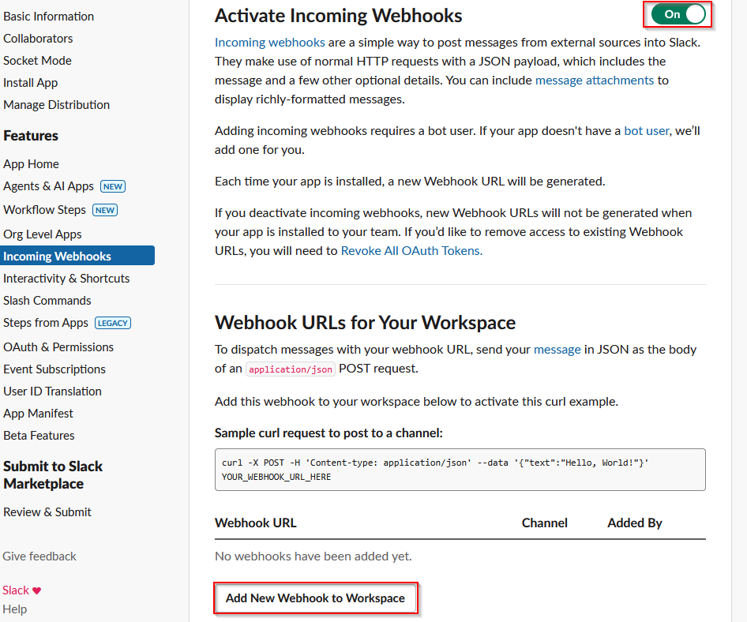
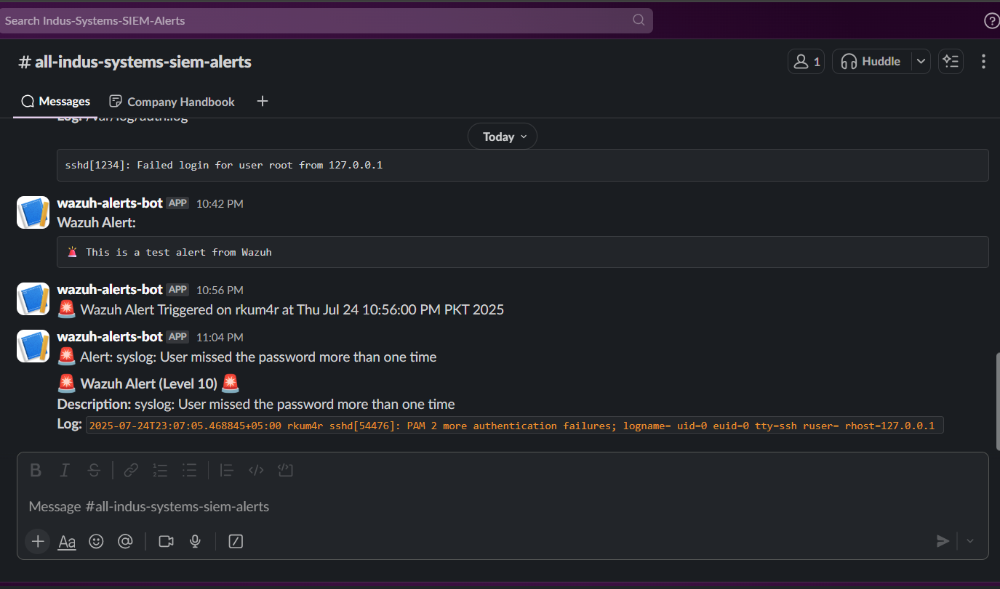

# Slack Integration with Wazuh Alerts

## Introduction: Slack in Modern IT Environments

[Slack](https://slack.com/) is a popular real-time messaging platform designed for collaboration across technical and non-technical teams. In IT operations and security environments, Slack is frequently used to:

- **Notify teams about infrastructure health**
- **Send CI/CD deployment logs**
- **Alert on security anomalies or system failures**
- **Facilitate cross-functional incident response**

By centralizing logs and notifications in Slack, organizations benefit from faster decision-making, improved visibility, and real-time response.

---

## Why Integrate Wazuh with Slack?

[Wazuh](https://wazuh.com/) is a powerful open-source Security Information and Event Management (SIEM) platform that collects and analyzes security events. While Wazuh logs alerts in its dashboard and files, real-time visibility into critical events is essential for rapid response.

### Key Benefits of Integration:

- **Real-Time Alerts**: Get notified immediately when suspicious or malicious activity is detected.
- **Efficient Collaboration**: Send alerts directly to Slack channels where DevOps or Security teams are active.
- **Improved Threat Response**: Reduce Mean Time to Detect (MTTD) and Mean Time to Respond (MTTR) by pushing alerts to human responders instantly.

---

## Understanding: Webhook vs. Webhook URL

### What is a Webhook?

A **webhook** is a method used by applications to send real-time data to other applications over HTTP. Instead of polling for changes, webhooks **"push"** the data as soon as an event happens.

### What is a Webhook URL?

A **Webhook URL** is a unique endpoint generated by the receiver application (e.g., Slack) that tells the sender (e.g., Wazuh) **where to send the data**.

#### Real-World Analogy:

- Think of a webhook as a **mailbox**.
- A webhook URL is the **address** of that mailbox.
- Wazuh writes the alert (the message) and drops it in that address (the webhook URL).
- Slack receives it and posts it in the specified channel.

---

## Prerequisites

- Wazuh Manager installed and operational
- Root access to the server where Wazuh Manager is running
- Slack Account and Slack Webhook API
- Administrative access to your Slack workspace
- Basic command-line knowledge

---

## Step 1: Create an Incoming Webhook in Slack

1. Visit: [https://api.slack.com/messaging/webhooks](https://api.slack.com/messaging/webhooks)
2. Click **"Create a Slack App"**

3. Choose **"From scratch"** and give your app a name like `Wazuh Alerts`, then select your Slack workspace

4. Under **Features**, enable **Incoming Webhooks**

5. Turn on the toggle to activate incoming webhooks
6. Click **Add New Webhook to Workspace**
7. Choose the Slack channel where you want alerts to appear
8. **Copy the Webhook URL** — this is the address your script will post alerts to

---

## Step 2: Create the Slack Alert Script

Create a custom alert script on your Wazuh manager:

```bash
sudo nano /var/ossec/active-response/bin/slack-alert.sh
````

Paste the following:

```bash
#!/bin/bash

# Slack Webhook URL
WEBHOOK_URL="https://hooks.slack.com/services/YOUR/WEBHOOK/URL"

# Read full input from stdin
read input

# Extract description, level, full_log using grep and awk
description=$(echo "$input" | grep -oP '"description"\s*:\s*"\K[^"]+')
level=$(echo "$input" | grep -oP '"level"\s*:\s*\K[0-9]+')
full_log=$(echo "$input" | grep -oP '"full_log"\s*:\s*"\K[^"]+')

# Construct Slack message
message="🚨 *Wazuh Alert (Level $level)* 🚨
*Description:* $description
*Log:* \`$full_log\`"

# Send to Slack
curl -X POST -H 'Content-type: application/json' --data "{\"text\":\"$message\"}" "$webhook_url"

```

> Replace `YOUR/WEBHOOK/URL` with the actual Webhook URL generated in Step 1.

---

## Step 3: Make the Script Executable

```bash
sudo chmod +x /var/ossec/active-response/bin/slack-alert.sh
```
---

## Step 4: Register the Script in `ossec.conf`

To trigger your custom Slack alert script, you must register it in the Wazuh configuration.

### 1. Open the Wazuh Configuration File

```bash
sudo nano /var/ossec/etc/ossec.conf
```

### 2. Define the Command (Inside the `<command>` block)

Locate the `<command>` section in the configuration and add the following entry:

```xml
<command>
  <name>slack_alert</name>
  <executable>slack-alert.sh</executable>
  <timeout_allowed>no</timeout_allowed>
</command>
```

This block defines a command named `slack_alert`, which points to the script file `slack-alert.sh` located inside `/var/ossec/active-response/bin/`. The `<timeout_allowed>` tag specifies whether Wazuh should terminate the script if it runs too long.

### 3. Configure Active Response (Inside the `<active-response>` block)

Next, add the active response configuration that tells Wazuh *when* to run the script:

```xml
<active-response>
  <command>slack_alert</command>
  <location>local</location>
  <rules_id>2502,100,101,1101,1110,18107,18108,18109,5710</rules_id>
  <level>10</level>
</active-response>
```

* `<command>`: Refers to the `name` value defined earlier.
* `<location>`: Set to `local` so the script runs on the agent or manager where the alert is generated.
* `<rules_id>`: Specifies which rule IDs should trigger the alert. You can modify this list as needed.
* `<level>`: Defines the minimum alert severity level to trigger this response. You can choose a threshold like `7` or `10` depending on your use case.

**Note:**
The rule ID `2502` is commonly used for detecting multiple failed SSH login attempts (a brute-force attack pattern).
You can either:

* Use specific `<rules_id>` for fine control, or
* Use `<level>10</level>` alone to trigger on all alerts above that severity without needing to specify individual rule IDs.

If you prefer to trigger based purely on severity level:

```xml
<active-response>
  <command>slack_alert</command>
  <location>local</location>
  <level>10</level>
</active-response>
```

---

## Step 5: Restart the Wazuh Manager

```bash
sudo systemctl restart wazuh-manager
```

---

## Step 6: Test the Integration

To simulate a brute-force SSH login attempt:

```bash
ssh fakeuser@localhost
# Enter incorrect password multiple times
```

You should receive a message in your Slack channel similar to:

```
Wazuh Alert (Level 10)
Description: syslog: User missed the password more than one time
Log: sshd[1234]: PAM 2 more authentication failures; logname= uid=0 euid=0 tty=ssh ruser= rhost=127.0.0.1
```

---

## What Happens Behind the Scenes?

1. Wazuh detects a log entry that matches a rule (e.g., failed SSH login).
2. That rule is tied to the `active-response` block in `ossec.conf`.
3. Wazuh invokes the `slack-alert.sh` script, passing the alert JSON via `stdin`.
4. The script extracts the alert level, description, and full log.
5. A formatted message is composed and sent to the designated Slack channel using the webhook URL.

---

## Optional: Temporarily Disable Slack Alerts

During maintenance or setup, you may want to disable Slack alerts without removing config.

### Recommended Method: Rename the Script

```bash
sudo mv /var/ossec/active-response/bin/slack-alert.sh /var/ossec/active-response/bin/slack-alert.sh.disabled
```

To re-enable:

```bash
sudo mv /var/ossec/active-response/bin/slack-alert.sh.disabled /var/ossec/active-response/bin/slack-alert.sh
```

> This disables alerting without editing `ossec.conf` or restarting Wazuh.

---

## Referencs

* [Slack Webhooks API Documentation](https://api.slack.com/messaging/webhooks)
* [Wazuh Official Documentation](https://documentation.wazuh.com/)
* [How to Integrate Wazuh with Slack Webhooks for Real-Time Security Alerts](https://ithardenup.com/how-to-integrate-wazuh-with-slack-webhooks-for-real-time-security-alerts/)

