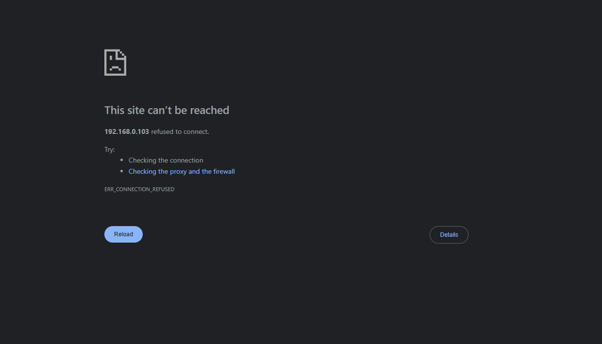

# Wazuh Dashboard Troubleshooting Guide

This guide helps you fix the issue where the **Wazuh Web UI is not accessible externally**, even when the Wazuh services are running.

---

## Problem

Wazuh Dashboard is running, but accessing it from your host browser shows:



---

## Root Cause

By default, the Wazuh Dashboard may only listen on the **localhost (127.0.0.1)** interface inside the VM, making it inaccessible from outside (host machine).

## Solution: Bind Dashboard to All Interfaces

### Step 1: Check What Interface Wazuh is Listening On

Run the following inside your Wazuh VM:

```bash
sudo netstat -tulnp | grep 443
````

Expected output for local-only:

```
tcp 0 0 127.0.0.1:443 0.0.0.0:* LISTEN ...
```

If you see this, it means the Dashboard is only accessible from within the VM.


### Step 2: Edit the Dashboard Config File

Open the config file for the Wazuh dashboard:

```bash
sudo nano /usr/share/wazuh-dashboard/config/opensearch_dashboards.yml
```

Find this line:

```yaml
server.host: "localhost"
```

Change it to:

```yaml
server.host: "0.0.0.0"
```

This tells the dashboard to listen on **all network interfaces**.


### Step 3: Restart the Wazuh Dashboard Service

Apply the config change:

```bash
sudo systemctl restart wazuh-dashboard
```

---

###  Step 4: Access Wazuh Dashboard in Browser

From your host machine (Windows/Linux/Mac), open your browser and go to:

```
https://<VM_IP_Address>
```

> Example: `https://192.168.0.103`

> ⚠️ You may get a browser warning about a self-signed certificate — proceed anyway.

---

## Additional Notes

* Ensure the Wazuh VM is in **Bridged Mode** or **NAT with Port Forwarding** so your host can access it.
* Make sure port `443` is not blocked by any firewall on host or guest.
* If you're not sure about the VM's IP, use:

  ```bash
  ip a
  ```


## References

* [Wazuh Documentation – Dashboard Configuration](https://documentation.wazuh.com/)
* [Wazuh GitHub](https://github.com/wazuh/wazuh)

**📖 Read Next:** [13 – Changing Logo & Favicon](../13-custom-branding/01-changing-logo-and-favicon.md) — Replacing default Wazuh branding.
