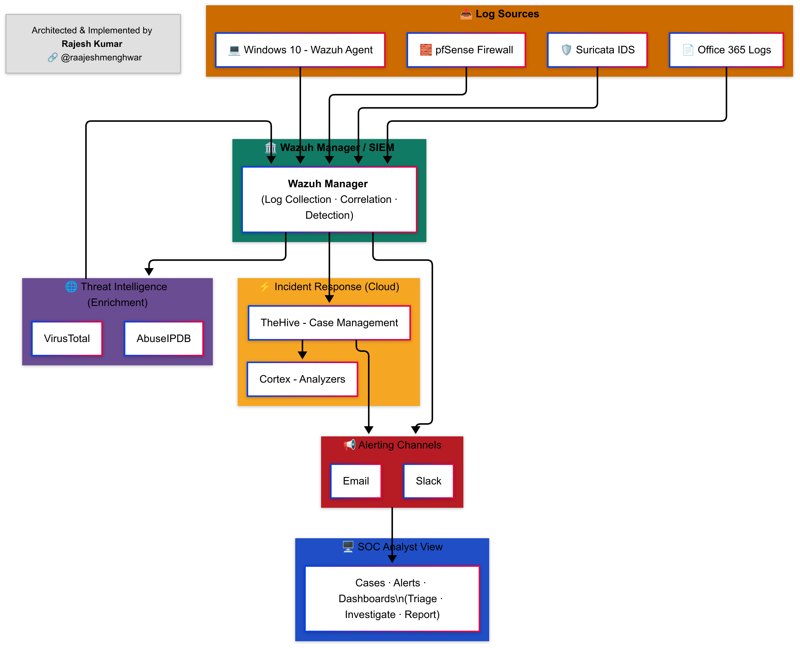

# Wazuh SOC & SIEM Notes

A structured, beginner-to-advanced collection of notes, guides, and configurations for building a **Security Operations Center (SOC)** using **Wazuh** as the SIEM platform.

Whether you are a **SOC Analyst**, **SIEM Engineer**, or a **cybersecurity learner**, this repository will guide you step-by-step — from understanding the basics to advanced integrations and configurations.

## How the Repository is Organized

The repository follows a **logical learning path**:

## 📂 Project Architecture

* **01: Introduction**
  * [Wazuh Overview](01-introduction/wazuh-overview.md): Introduction to Wazuh, its components, and its role in a SOC.
* **02: Installation**
  * [Wazuh Basic Installation](02-installation/wazuh-basic-installation.md): Step-by-step installation for lab or production.
  * [Wazuh Settings Reference](02-installation/wazuh-settings-reference.md): Explanation of key configuration parameters.
* **03: Configuration**
  * [Agent Authentication](03-configuration/agent-authentication.md): Setting up and authenticating agents.
  * [OSSEC Configuration Guide](03-configuration/ossec-configuration-guide.md): Understanding OSSEC rules, decoders, and configuration in Wazuh.
  * [SSL Setup](03-configuration/ssl-setup.md): Securing Wazuh communications with SSL/TLS.
* **04: Log Sources**
  * [Office 365 Logs Integration](04-log-sources/office365-logs-integration.md): Collecting and parsing Office 365 logs in Wazuh.
* **05: Network Monitoring**
  * [pfSense with Wazuh](05-network-monitoring/pfsense-with-wazuh.md): Firewall log collection with pfSense.
  * [Suricata IDS Integration](05-network-monitoring/suricata-ids-integration.md): Integrating Suricata IDS for network threat detection.
* **06: Alerting**
  * [Alerting Overview](06-alerting/alerting-overview.md): How Wazuh generates and processes alerts.
  * [Email Integration](06-alerting/email-integration.md): Sending alerts via email.
  * [Slack Integration](06-alerting/slack-integration.md): Sending alerts to Slack channels.
* **07: Dashboarding**
  * [Multi-Tenancy](07-dashboarding/multi-tenancy.md): Setting up multiple tenants for separate teams or clients.
* **08: Threat Intelligence**
  * [Threat Intelligence Overview](08-threat-intelligence/01-threat-intelligence-overview.md): Understanding TI in Wazuh.
  * [AbuseIPDB Integration](08-threat-intelligence/abuseipdb-integration.md): Blocking known malicious IPs.
  * [Shodan.io Integration](08-threat-intelligence/shodan.io-integration.md): Using Shodan data to enhance detections.
  * [VirusTotal Integration](08-threat-intelligence/virustotal-integration.md): File and hash reputation lookups.
* **09: Incident Response**
  * [Security Incident Response Overview](09-incident-response/security-incident-response-overview.md): SOC response process.
  * [TheHive Integration](09-incident-response/thehive-integration.md): Managing incidents with TheHive.
* **10: Hardening & Security**
  * *(Placeholder)*: Best practices for securing your Wazuh environment.
* **11: Automation**
  * *(Placeholder)*: Scripts and workflows for automating Wazuh tasks.
* **12: Troubleshooting**
  * [Dashboard Refuse to Connect](12-troubleshooting/dashboard-refuse-to-connect.md): Fixing the “Dashboard Refused to Connect” error.
* **13: Custom Branding**
  * [Changing Logo & Favicon](13-custom-branding/01-changing-logo-and-favicon.md): Replacing default Wazuh branding.
  * [Customizing Login Page](13-custom-branding/02-customizing-login-page.md): Personalizing the login screen.
  * [Changing Browser Tab Favicon](13-custom-branding/03-changing-browser-tab-favicon.md): Updating the browser tab icon.
  * [App Settings Logos](13-custom-branding/04-app-settings-logos.md): Modifying in-app logos.
  * [Modifying Application Title & Header](13-custom-branding/05-modifying-application-title-and-header.md): Updating page titles and headers.

<!-- ## 📸 Final SOC Setup — Screenshots

### Wazuh Dashboard

### Suricata UI

### Full SOC View

 -->

## 📚 Who This Is For
- SOC Analysts setting up a lab.
- SIEM Engineers learning Wazuh.
- Cybersecurity students exploring open-source SOC tools.

## 🔗 Useful References

* [Wazuh Documentation](https://documentation.wazuh.com)
* [TheHive Documentation](https://docs.strangebee.com/thehive)
* [Suricata Documentation](https://suricata.io/documentation/)

### About the Author
This project is maintained by Rajesh Kumar. Some call it hacking; I call it curiosity with root access. Every commit and every write-up is just another footprint on my learning path.

Fork it. Break it. Patch it. Improve it.
If you spot something off — whether it’s a logic flaw or a typo I missed while drowning in logs — open a pull request. I respect all clean code and clever fixes.

Find me in the wild:

- [LinkedIn – Professional Footprint](https://www.linkedin.com/in/raajeshmenghwar/)
- [Medium – Write-ups & Case Files](https://medium.com/@rajeshmenghwar)
- [GitHub – Code & Experiments](https://github.com/raajeshmenghwar)

