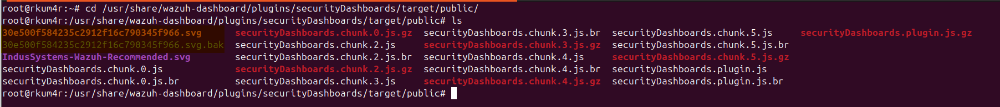
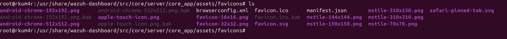

# Custom Branding: Changing Logo and Favicon

This guide walks you through replacing the Wazuh Dashboard's default logo and favicon with your own branding assets.

---

## 1. Replace Dashboard Logo

### Location
```bash
cd /usr/share/wazuh-dashboard/plugins/securityDashboards/target/public/
````

Inside this directory, you will find a `.svg` file (e.g., `30e500f584235c2912f16c790345f966.svg`) that serves as the default logo.

### Backup Original

```bash
mv 30e500f584235c2912f16c790345f966.svg 30e500f584235c2912f16c790345f966.svg.bak
```

### Replace with Custom Logo

Download or copy your own `.svg` logo and rename it to match the original filename:

```bash
mv my-custom-logo.svg 30e500f584235c2912f16c790345f966.svg
```


---
## 2. Change Favicon (Browser Tab Icon)
Use upload your logo at https://realfavicongenerator.net/ and download the favicons generatored .zip file.
Unzip it

### Location

```bash
cd /usr/share/wazuh-dashboard/src/core/server/core_app/assets/favicons
```

### Backup Existing Favicons

```bash
mkdir -p ../old-favicons
mv * ../old-favicons/
```

### Add Your Favicons

Paste your own `.ico`, `.png`, or `.svg` favicon files into the current directory.

> Ensure filenames and formats match the previous ones if you want to retain compatibility across all browsers.


---

## 3. Restart Wazuh Dashboard

After making the changes:

```bash
sudo systemctl restart wazuh-dashboard
```


