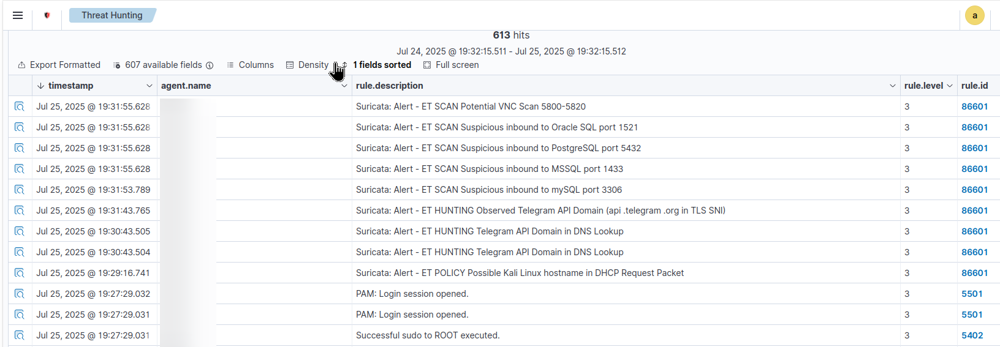

# Suricata Integration with Wazuh SIEM

## Overview

[**Suricata**](https://suricata.io/) is a high-performance, open-source network threat detection engine developed by the [Open Information Security Foundation (OISF)](https://oisf.net). It functions as:

* **Intrusion Detection System (IDS)**
* **Intrusion Prevention System (IPS)**
* **Network Security Monitoring (NSM)** tool

Suricata analyzes traffic using deep packet inspection (DPI), pattern matching, and protocol analysis. Its behavior is driven by customizable and community-maintained **rule sets**.

---

## Why Use Suricata with Wazuh?

Wazuh integrates with Suricata to centralize, enrich, and correlate Suricata’s security event logs. This integration allows security teams to detect, investigate, and respond to network-based threats within the Wazuh SIEM platform.

**Use cases include:**

* Detecting reconnaissance activities like port scans
* Triggering alerts based on suspicious packet signatures
* Enriching host-based logs with network-layer visibility

---

## Suricata vs. Other Tools

**How does Suricata compare to other popular NIDS/NSM tools?**

* **[Snort](https://snort.org/)**: Mature and widely adopted, but single-threaded (less performant on multi-core systems)
* **[Zeek (Bro)](https://zeek.org/)**: Focuses on protocol-level behavior analysis and scripting, great for detailed logging and investigation
* **[Suricata](https://suricata.io/)**: Multithreaded, high-speed engine supporting IDS/IPS/NSM modes with deep packet inspection and community rulesets

---

## Where Should Suricata Be Installed?

Suricata is a powerful network threat detection engine, but it **must be placed strategically** in your network to be effective and useful in your Wazuh SIEM setup.

### Recommended Installation Locations

- **Wazuh Manager**  
  Place Suricata on the same host as the Wazuh Manager. This allows Wazuh to easily access and process Suricata's alerts (from `/var/log/suricata/fast.log` or `/eve.json`) **without needing external log forwarding**.

- **DMZ Nodes / Perimeter Servers / Bastion Hosts / Web Servers**  
  These are high-exposure points where incoming and outgoing traffic should be monitored closely. Installing Suricata here helps detect scanning, malware, or C2 activities **before they reach internal assets**.

### Not Recommended (Unless Necessary)

- **Normal Endpoints / Workstations / Desktops**  
  Do **not** install Suricata on every endpoint. It can cause confusion and unnecessary resource consumption.

  Only consider it when:
  - You're running **high-risk services** on the host
  - You need **deep packet inspection** at the endpoint level
  - You have the infrastructure to **manually manage, ship, and analyze logs** from multiple agents

**Install Suricata only where it makes sense** — near network entry/exit points or on the Wazuh Manager itself — **not on every endpoint.**

---

## Step 1: Install Suricata

```bash
sudo add-apt-repository ppa:oisf/suricata-stable
sudo apt-get update
sudo apt-get install suricata -y
```

Verify the installation:

```bash
suricata -V
# Output: Suricata version 8.x.x RELEASE
```

---

## Step 2: Install and Configure Rules

### 2.1 Download Emerging Threats (ET) Rules

[Emerging Threats](https://rules.emergingthreats.net/) provides community-maintained IDS/IPS rules compatible with Suricata.

```bash
cd /tmp/
curl -LO https://rules.emergingthreats.net/open/suricata-6.0.8/emerging.rules.tar.gz
tar -xvzf emerging.rules.tar.gz
sudo mkdir -p /etc/suricata/rules
sudo mv rules/*.rules /etc/suricata/rules/
sudo chmod 640 /etc/suricata/rules/*.rules
```

---

## Step 3: Configure `suricata.yaml`

Open the configuration:

```bash
sudo nano /etc/suricata/suricata.yaml
```

### 3.1 Define Network Ranges

```yaml
HOME_NET: "<YOUR_IP_ADDRESS>"   # Replace with your actual IP
# EXTERNAL_NET: "!$HOME_NET"    # Comment this line
EXTERNAL_NET: "any"             # Un-comment this line
```

To find your IP:

```bash
ip a
```

### 3.2 Set the Network Interface

Search for the `af-packet` section and set your interface (e.g., `ens33`):

```yaml
af-packet:
  - interface: ens33
```

To list interfaces:

```bash
ip link show
```

### 3.3 Set Rule Paths

Ensure Suricata loads your rules:

```yaml
default-rule-path: /etc/suricata/rules

rule-files:
  - "*.rules"
```

> This tells Suricata to load **all `.rules` files** in `/etc/suricata/rules`.

### 3.4 Restart Suricata

```bash
sudo systemctl restart suricata
sudo systemctl status suricata
```

---

## Step 4: Integrate Suricata with Wazuh

### 4.1 Suricata Log Path

Suricata logs in JSON format to:

```
/var/log/suricata/eve.json
```

### 4.2 Configure Wazuh to Ingest Logs

Edit the Wazuh Manager config:

```bash
sudo nano /var/ossec/etc/ossec.conf
```

Add inside `<ossec_config>`:

```xml
<localfile>
  <log_format>json</log_format>
  <location>/var/log/suricata/eve.json</location>
</localfile>
```

### 4.3 Restart Wazuh Manager

```bash
sudo systemctl restart wazuh-manager
```

Verify services:

```bash
sudo systemctl status wazuh-manager wazuh-dashboard wazuh-indexer
```

---

## Step 5: Simulate Detection

From a Kali Linux attacker machine:

```bash
nmap -sS -T4 <TARGET-IP>
```

Explanation:

* `-sS`: SYN scan (stealth)
* `-T4`: Fast scan timing

This should trigger Suricata alerts for **Nmap scanning**.

---

## Step 6: View Alerts in the Wazuh Dashboard

1. Open **Wazuh Dashboard**
2. Navigate to **Security Events**
3. Select the agent running Suricata
4. Filter by **Rule Group: Suricata**


Example alert:

```
ET SCAN Nmap Synchronous Scan
```

---

## Monitor Suricata Logs (CLI)

View plain-text alerts:

```bash
sudo cat /var/log/suricata/fast.log
```

View structured JSON logs:

```bash
jq '.' /var/log/suricata/eve.json
```

Install `jq` if needed:

```bash
sudo apt install jq
```

---

## Troubleshooting

| Issue                      | Cause                             | Solution                                    |
| -------------------------- | --------------------------------- | ------------------------------------------- |
| No alerts/logs in Wazuh    | Suricata not logging or misconfig | Check interface, rule paths, log format     |
| `eve.json` empty           | No matching rules triggered       | Simulate an attack (e.g., `nmap`)           |
| Permission denied on rules | Incorrect file permissions        | Use `chmod 640` on rule files               |
| Service failed to start    | YAML syntax error                 | Test config with `suricata -T -c /path/...` |

---

## Summary

* **Suricata** enhances Wazuh by providing deep network visibility via IDS/IPS capabilities.
* Install Suricata **on the same host as Wazuh Manager** for seamless integration.
* Use **Emerging Threats rulesets** for baseline coverage.
* Configure `suricata.yaml` carefully: network interface, IP ranges, and rules path.
* Ingest logs from `eve.json` using Wazuh’s `<localfile>` directive.
* Validate integration via Nmap and the Wazuh dashboard.

---

## Next Steps

After validating Suricata integration:

* Tune detection rules for your environment
* Integrate additional threat intelligence sources
* Consider extending to perimeter devices (e.g., pfSense, network firewalls)
* Monitor performance impact on high-throughput nodes

